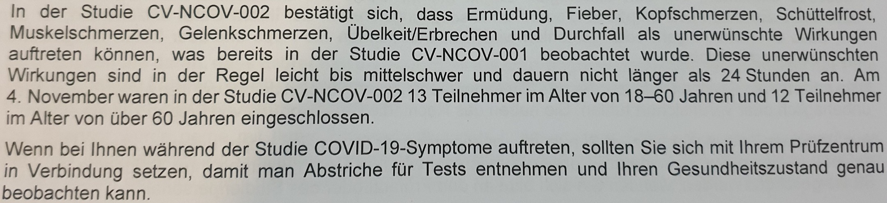
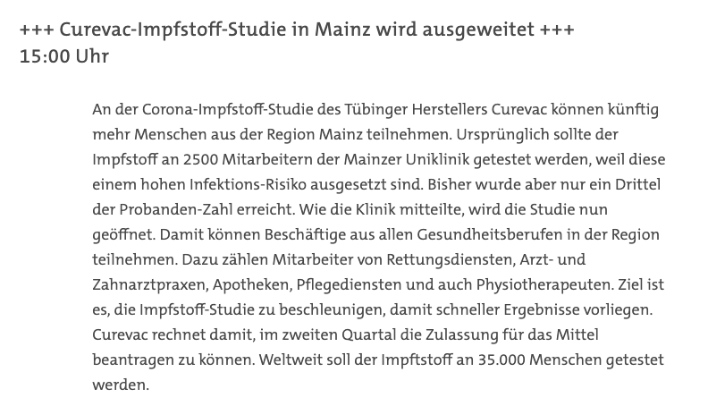
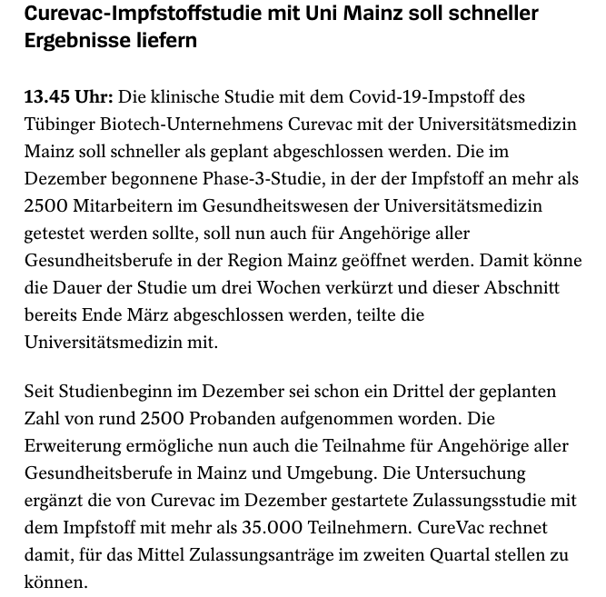

## Proband bei der Phase 3 Sars-CoV-2 mRNA Impfstudie von CureVac

Als Student (und Mitarbeiter) der Unimedizin Mainz habe ich die [Chance](https://www.aerztezeitung.de/Wirtschaft/CureVac-testet-Corona-Impfstoff-an-Klinikmitarbeitern-415801.html), freiwillig an der [Phase 3 Sars-CoV-2 mRNA Impfstudie](https://clinicaltrials.gov/ct2/show/NCT04674189) von [CureVac](https://www.curevac.com/covid-19/) aus Tübingen teilzunehmen. Als ich diese Mail bekam, habe ich mich mit meiner Familie beraten und obwohl es mit homeschooling und meiner Klausurenphase stressig genug ist, stand die Entscheidung doch relativ schnell fest. Ich habe mir noch die Erlaubnis vom Studienleiter geholt, dass ich über meine Erfahrungen als Proband öffentlich berichten darf, wenn ich in meinem "Blog deutlich mache(n), dass es sich nicht um offizielle Verlautbarungen der Studie, der Studienleitung oder des Sponsors handelt, sondern um einen persönlichen Erfahrungsbericht." Und genauso ist es. Ich stehe weder mit CureVac noch mit der Studienleitung in irgendeiner Beziehung und berichte von meinen persönlichen Erfahrungen und füge einen wissenschaftlichen Rahmen hinzu.

**Worum geht es in dieser Studie?**

Es geht um einen mRNA-basierten Impfstoff gegen Sars-CoV-2 der Firma [CureVac](https://www.ndr.de/fernsehen/sendungen/panorama_die_reporter/Curevac,curevac104.html) mit Sitz in Tübingen. Wie auch andere mRNA Impfstoffe [kodiert dieser für das Spike-Protein](https://www.pei.de/SharedDocs/Downloads/DE/newsroom/dossiers/praesentation-curevac-zweite-studie-sars-cov-2-impfstoff.pdf?__blob=publicationFile&v=2). Ziel ist es auch hier, dass diese mRNA (als DER natürliche Informationsvermittler in unseren Zellen) von den Zellen im Oberarm aufgenommen wird, die dann das Spike-Protein produzieren und somit Zellen unseres Immunsystem auf eben dieses Protein trainiert werden [zu reagieren](https://www.youtube.com/watch?v=0LnkoEOHSiM&t=1s). In [prä-klinischen Studien](https://www.pei.de/SharedDocs/Downloads/DE/newsroom/dossiers/praesentation-curevac-zweite-studie-sars-cov-2-impfstoff.pdf) hat der Impfstoffkandidat in Mäusen hohe Titer an neutralisierenden Antikörpern gegen Sars-CoV-2 erzeugt. In einer Phase 1 Studie an 248 Personen kam es zu keinen ["ungewöhnlichen Vorkommnissen"](https://www.aerzteblatt.de/nachrichten/118229/COVID-19-Impfstoff-von-Curevac-erzielt-guenstige-Zwischenergebnisse-in-Phase-1-Studie) und es gab lediglich leichte bis mäßige Reaktionen von vorübergehender Dauer (wie auch bei den anderen mRNA Impfstoffen). 
Seit September läuft eine Phase 2a Studie mit 660 Probanden, in der es um die ["Dosisbestätigung"](https://www.curevac.com/covid-19/) geht. 
Zulassungsrelevant ist die Phase 2b/3 Studie und an dieser [Phase 3 Studie](https://flexikon.doccheck.com/de/Phase-III-Studie) nehme ich teil, mit dem [Ziel](https://www.curevac.com/covid-19/): "in der Phase 3 [wird] die Wirksamkeit von CVnCoV untersucht. Die Studie findet an mehreren Standorten statt, wobei den Probanden im Abstand von 28 Tagen [CVnCoV](https://de.wikipedia.org/wiki/CVnCoV) oder ein Placebo injiziert wird" .

**Warum mache ich mit?**

- **Respekt:** Ich habe einen riesen Respekt vor diesem neu-artigen Virus, welches eben [nicht vergleichbar mit einer Grippe](https://www.pharmazeutische-zeitung.de/covid-19-ist-definitiv-gefaehrlicher-als-die-grippe-122629/) ist. Auch bei geringer Wahrscheinlichkeit eines schweren Verlaufs (bei mir als gesundem jungen Menschen), möchte ich nicht auf der Intensivstation liegen müssen, wenn es doch eine impfpräventable Alternative gibt. Viel höher ist die Wahrscheinlichkeit eines milden Verlaufs bei Infektion, aber leider mit [Langzeitfolgen](https://www.quarks.de/gesundheit/medizin/langzeitschaeden-von-covid-19-was-wir-wissen-und-was-nicht/). COVID-19 ist eine [Multisystemerkrankung](https://www.medical-tribune.de/medizin-und-forschung/artikel/post-covid-syndrom-multisystemerkrankung-kann-langzeitfolgen-haben/) und dieses Virus wurde schon in [zahlreichen Organen nachgewiesen](https://journals.plos.org/plospathogens/article?id=10.1371/journal.ppat.1009037). Ehrlich, das möchte ich nicht haben. Zusätzlich steigert die höhere Übertragbarkeit der [neuen Mutationen](https://www.ndr.de/nachrichten/info/72-Coronavirus-Update-Menschen-Massnahmen-Mutationen,podcastcoronavirus280.html#Verbreitung) meinen Respekt noch zusätzlich.

- **Impfung:** Ich würde mich sofort mit Corminaty impfen lassen, aber ich bin in der Prioritätenliste ganz unten. Wann ich also geimpft werden darf, ist noch unklar. Also hoffe ich natürlich auch, dass ich in dieser Studie zur Impfgruppe gehöre. Es gibt 3 Gruppen, wovon 1 Placebo (Kochsalz) ist. Das heißt die Chance den richtigen Impfstoff zu erhalten, liegt bei 67%. Natürlich ist eine Wirksamkeit noch nicht bewiesen (dafür gibt es ja genau diese Phase 3), aber [neue präklinische Ergebnisse](https://www.biorxiv.org/content/10.1101/2020.12.23.424138v1) sehen doch sehr vielversprechend aus.

- **Vertrauen:** Ich habe vollstes Vertrauen sowohl in die mRNA Technologie, die beteiligten Hersteller (hier v.A. BioNTech und CureVac) und die Wissenschaft.  mRNA ist DER natürliche und physiologische Informationsträger in unseren Zellen und kommt da zuhauf und ständig vor, wird von der DNA abgelesen, in Proteine übersetzt und dann schnell wieder abgebaut. Und zwar genau in dieser Richtung (und nicht umgekehrt). mRNA von außen zu verabreichen und dann den Rest die Zelle machen zu lassen, ist also im Prinzip eine natürliche und ganzheitliche Form des Impfens, da die Zellen mit dieser mRNA genau das macht, was sie mit all ihren mRNAs macht: in Proteine übersetzen und dann diese mRNA sehr schnell wieder abbauen (https://praxis-hanefeld.com/covid-vaccine.php). Und nein, da wird nichts in das [Genom eingebaut](https://www.youtube.com/watch?v=l-XzMIu8Mww&t=2253s).
Auch ist es nicht richtig, dass es noch keine Erfahrungen mit dieser Technologie [gibt](https://marc-hanefeld.de/mrna-impfung_kritik/). Der mRNA Technologie von BioNTech und [TRON](https://tron-mainz.de/) gehen mehr als 20 Jahre Forschung und Entwicklung mit etlichen klinischen Studien in der Krebsimmuntherapie [voraus](https://twitter.com/sebboeg/status/1326949307052937216?s=20) und auch CureVac hat bereits mRNA Impfstoffe gegen verschiedene Krankheiten in [klinischen Studien](https://www.curevac.com/pipeline/) getestet.
Ich hatte die wundervolle Gelegenheit, 5 Jahre lang an der Entwicklung von individualisierten [mRNA-basierten Krebsimmuntherapien](https://www.hindawi.com/journals/jir/2015/595363/) [mitzuarbeiten](https://www.linkedin.com/pulse/my-phd-thesis-explained-precise-view-genes-dr-sebastian-boegel/) und weiß wieviel Leidenschaft, Engagement, Professionalität, wissenschaftliche Exzellenz und uvm. in einem großartigen Team dahintersteht.

- **Mehr Impfstoff & Wissenschaft:** diese Phase 3 Studie entscheidet über die Zulassung eines weiteren dringend gebrauchten Impfstoffs. Jeder eingeschloßene Proband ist also wichtig zum Erreichen dieses Ziels und leistet somit einen wissenschaftlichen Beitrag.

- **Neugier:** ich bin sehr gespannt auf diese Erfahrung auf der anderen, nämlich der Probandenseite, zu stehen. Trotz aller Überzeugung und der soliden wissenschaftlichen Basis des Ganzen, wie wird es mir ergehen, kurz bevor ich wirklich die Spritzen bekomme? Zweifel? Wie wird es mir danach ergehen?  

Einziger Wermutstropfen aus der Sicht eines Probanden: die Studie dauert 13,5 Monate (Tag 1 bis 393) und in dieser Zeit soll man sich natürlich nicht mit einem anderen Sars-CoV-2 Impfstoff impfen lassen. Unglücklich, wenn man also in der Placebo-Gruppe ist (das weiß man natürlich nicht). Aber das nehme ich in Kauf, denn zum Einen ist placebo-kontrolliert der Gold-Standard und zum Anderen werde ich auch während der Studie genauso vorsichtig agieren wie davor.

**Warum will ich darüber schreiben?**

Will man sich als potentieller Impfling über die Impfung informieren, so ließt man immer wieder Unsinn, den man selbst vielleicht nur schwer einordnen kann und dadurch massiv verunsichert wird. Vielleicht kann dieser Blog einen kleinen bescheidenen Beitrag dazu leisten Missverständnisse zu beseitigen und eventuell somit Sorgen zu nehmen.Es wird natürlich nicht jeden Tag ein Update geben, sondern nur, wenn etwas spannendes passiert. Am Anfang mehr, dann wahrscheinlich weniger. Auch werde ich es nicht schaffen immer tagesaktuell zu schreiben. Da ich aber nicht nur Proband, sondern auch Wissenschaftler und angehender Mediziner, werde ich versuchen evidenz- und emotions-basiertes bloggen so zu vereinen um der [Verantwortung](https://www.dgim.de/fileadmin/user_upload/PDF/Pressemeldungen/20201217_DGIM_Aufruf_DGIM_AWMF_FINAL.pdf) gerecht zu werden.

## Tag 1: Die Spritze

Zum vereinbarten Termin musste ich meinen Impfausweis und den zu Hause ausgefüllten Anamnesebogen mitbringen. Zu allererst bekam ich das 23-seitige Dokument "Probandeninformation und Einwilligungserklärung für Teilnehmer der klinischen Studie", welches ich mir in Ruhe durchlesen sollte. Im Wesentlichen ist dort sehr detailliert und anschaulich beschrieben: Ziele der Studie, Ablauf, Risiken und Belastungen, Freiwilligkeit, möglicher Nutzen für einen selbst, Ein- und Ausschlusskriterien (auch nachzulesen [hier](https://clinicaltrials.gov/ct2/show/NCT04652102) unter "Criteria"), Datenschutz, Informationen zu biologischem Material. Danach gab es eine wirklich vorbildliche Untersuchung, wie man sie im Studium lernt (bis auf die Eingangsfrage: "Warum sind Sie hier/ Was kann ich für Sie tun?"):

-**ausführliche Anamnese:** Fragen nach Vorerkranungen (also im Prinzip sind wir den von mir ausgefüllten Anamnesebogfen durchgegangen), ob ich schonmal Covid hatte, etc... Zwischendrin Formulare ausfüllen, Impfausweis durchforsten. Außerdem bin ich jetzt stolzer Besitzer eines Fieberthermometers, so eins mit Messspitze für den Mund (oder Po). Auch war genug Raum da für Nachfragen.

-**körperlicher Untersuchung:** "keine Diagnose durch die Hose", neurologische Untersuchungen, Herz, Lungen, Bauch abgehört (letzte beiden auch abgeklopft und Bauch gedrückt), Lymphknoten getastet, Blutdruck.

Danach Blutabnahme und ich war wohl in die Studie eingeschlossen, denn nach einer kurzen Wartezeit wurde der Impfstoff (oder Placebo) für mich frisch aus der Klinikapotheke geholt und der magische Moment war gekommen. Hab drauf verzichtet jemanden nach einem Foto zu fragen während mir die Spritze gegeben wurde. War auch sehr unspektakulär in den linken Oberarm (wie also bei jeder anderen Impfung auch). Danach musste ich 30 Minuten dort bleiben und wurde beobachtet, Blutdruck gemessen, befragt und das weitere Vorgehen erklärt: ich muss jeden Tag Tagebuch führen. Dafür habe ich einen Schnellhefter mit  (!) bekommen: Tabelle 1 - Reaktionen an der Einschnittstelle, Tabelle 2 - Allgemeine Reaktionen. Notfallnummern (Tag und Nacht) sind auch dabei. Sollte irgendwas ungewöhnlich sein oder ich Covid-Symptome spüre, werde ich einbestellt, untersucht und getestet.

**Und wie geht es mir?**

Ich habe die ganze Zeit in mich gehört in der Hoffnung irgendwas zu spüren. Irgendetwas, das mir verrät, dass ich die mRNA bekommen habe und gerade eine Immunantwort im musculus deltoideus losgetreten wird. Aber irgendwie merke ich nix. Um die Einstichstelle war es etwas rot, aber das war relativ schnell weg. Interessanterweise haben lediglich 5% der Impfgruppe und sogar 1% der Placebo Gruppe der BioNTech Studie ([16-55 Yr of Age, Dose 1](https://pubmed.ncbi.nlm.nih.gov/33301246/#&gid=article-figures&pid=figure-2-uid-1)) eine Rötung am Arm. Diese Statistik hilft mir also nicht weiter. Des Weiteren war mein Blutdruck (1 Messung) etwas erhöht, aber ansonsten war alles super. 

**Fazit am Ende von Tag 1**

Ich freue mich und bin dankbar über diese Chance, mit dabei zu sein. Überrascht bin ich von der Tatsache, dass ich vor Einschluss in die Studie nicht auf eine aktuelle (mit PCR) oder eine frühere SARS-CoV-2 Infektion (Antikörper) getestet wurde. Auch bin ich etwas verwundert über die Papierdokumentation. Ich frage mich ob das die Compliance bei den Teilnehmern erhöht.
Große Hoffnung und den Wunsch habe ich, dass ich noch irgendwann im Laufe des Abends oder der Nacht irgendeine (zwar selten vorkommende, aber beschriebene und kurz anhaltende) Impfreaktion (nicht Nebenwirkung!!, z.B. [Übelkeit, Schwindel etc.](https://pubmed.ncbi.nlm.nih.gov/33301246/#&gid=article-figures&pid=figure-2-uid-1)) zeige.

## Tag 2: Der Anruf

Und da war es: an diesem Morgen bin ich mit Kopfschmerzen aufgewacht. Ich habe mich noch nie so über Kopfschmerzen gefreut. Dies habe ich auch sehr freudig der Mitarbeiterin des Studienzentrums mitgeteilt, als sie mich anrief (obligatorischer Telefonanruf am Tag nach der Spritze) um sich nach meinem Befinden zu erkundigen. Alles super hier, kein Fieber, nur etwas Kopfschmerzen und gute Stimmung!

**Warum freue ich mich?**

Kopfschmerzen als "unerwünschte Wirkung" (dabei ist es eher eine Impfreaktion) wurden sowohl in der vorangeganen Studie mit dem CureVac-Impfstoff , als auch bei 42% Prozent der Impfgruppe in der BioNTech Studie ([16-55 Yr of Age, Dose 1](https://pubmed.ncbi.nlm.nih.gov/33301246/#&gid=article-figures&pid=figure-2-uid-1) berichtet. 

**Kopfschmerzen nach Impfung, hä?**

In dem mRNA Impfstoff ist ein ungefährlicher Teil des Virus codiert (das Spike Protein, welches als Andockstelle dem echten Virus ermöglicht in die Zellen einzudringen und das ist auch das Protein welches aktuell als mutiert gefunden wird). Die mRNA dieses Spike Proteins wird von den Zellen 
im Oberarm (dem Ort der Injektion) in Protein übersetzt, wieder zerhäckselt (abgebaut) und an der Zelloberfläche dem Immunsystem präsentiert. Das passiert ständig in unseren Zellen, v.A. mit körpereigenen Proteinen. Im Falle aber eines fremden Proteins (hier vom Virus) erkennt das Immunsystem, dass das 
da nicht hingehört und beginnt Alarm zu schlagen. Das Alarmsignal in unserem Körper sind Entzündungsbotenstoffe (zur anschaulicheren und unterhaltsameren Erklärung wie das ganze funktioniert, empfehle ich das [Video von Dr. Martin Moder](https://www.youtube.com/watch?v=0LnkoEOHSiM)). Eines dieser wichtigten Alarmsignale, sind die Interferone . Diese werden bei der Entzündungsreaktion auf Infektionen mit z.B. Viren und Bakterien produziert. Dies ist quasi der Start für eine Reihe von sogenannten Signalkaskaden, der Körper versucht jetzt also alles um diese Infektion zu bekämpfen. Dass dieses "Aufrüsten" nicht immer unbemerkt bleibt, kann man sich bestimmt gut vorstellen. So ist von Interferonen [bekannt](https://www.gelbe-liste.de/wirkstoffgruppen/interferone), dass sie (kurzfristig) zu Kopfschmerzen (und/oder grippe-ähnlichen Symptomen) führen können. Dies ist aber harmlos und nur von kurzer Dauer. Also alles super hier. Könnte also dafür sprechen, dass ich den Impfstoff bekommen habe. Yeah!

**Oder?**

-Auf der anderen Seite gaben interessanterweise auch 34% der Probanden der Placebo-Gruppe in der BioNTech Studie ([16-55 Yr of Age, Dose 1](https://pubmed.ncbi.nlm.nih.gov/33301246/#&gid=article-figures&pid=figure-2-uid-1) Kopfschmerzen nach der "Impfung" an. Sehr interessant!
-Des Weiteren kann es aber natürlich auch sein, dass die Kopfschmerzen von den nächtlichen Tritten und Füßen des Sohnes in meinem Gesicht kommen (Eltern von Kleinkindern wissen was ich meine und ich denke, dafür braucht es keine wissenschaftliche Erklärung über die molekularen Grundlagen).

Also, an dieser Stelle hilft mir dieses Symptom nicht weiter zu erraten in welcher Gruppe ich bin. Das ist auch eigentlich gut so, denn placebo-kontrollierte, randomisierte, doppel-verblindete (also weder der Arzt noch ich wissen, was ich bekommen habe) Studien sind deswegen Gold-Standard, weil sie eben u.A. verblindet sind (dazu zu einem späteren Zeitpunkt mehr).

**Fazit am Ende von Tag 2**

"Da steh' ich nun, ich armer Tor, Und bin so klug als wie zuvor!" (Goethe et al., 1808) 

**Leseempfehlung**

Wer einen schön geschriebenen Erfahrungsbericht einer Kollegin, die wirklich richtig geimpft wurde, lesen möchte, dem empfehle ich diesen [Blog](https://www.salonkolumnisten.com/autor/marisakurz).

## Tag 3: Papierkram

Wunderbar. Kopfschmerzen sind weg und alles ist super. Als ob nichts gewesen wäre. Kann ich mich also jetzt auf meine Klausuren konzentrieren. Pünktlich um 18 Uhr kommt die tägliche automatisierte Erinnerungsmail vom Studienzentrum, die "dokumentation der Nebenwirkungen" in den mitgegeben Tabellen auszufüllen. Ich bin jetzt schon ziemlich gestresst vom vielen Blättern und manuellen Ausfüllen. Solch eine Studie kostet so viel Geld, da verstehe ich nicht, warum es nicht drin war eine App oder eine Webseite aufzusetzen um genau dieses abzufragen. Man wird so lange erinnert bis man seine Angaben für diesen Tag gemacht hat. Mit KI oder (nocch abgefahrener) echten Menschen, könnte man dann auf ungwöhnliche "Nebenwirkungen" und/oder Symptomschilderungen sofort reagieren und den Studienteilnehmer anrufen. Die Dokumentation der Probanden ist solch ein wichtiger Teil bei der Studie um z.B. die Sicherheit zu belegen, dass es für mich unverständlich ist, quasi unkontrolliert allein dem Probanden zu überlassen. Solch eine Papierdokumentation kann leicht dazu führen, zu sagen: "Trage ich morgen ein, bin jetzt zu müde... oder habe Spätschicht ..... etc.". 
Um fair zu sein: in der Mappe, die jedem Studienteilnehmer ausgehändigt wurde, gibt es eine Anleitung zu einem elektronischen Tagebuch, zu dem man irgendwann eingeladen wird. Was es damit auf sich hat, weiß ich noch nicht. So verbleibe ich jetzt einfach mal in der Hoffnung geimpft zu sein.

An Tag 29 gibt es die 2. Dosis. Ich bin gespannt.

## Tag 8: Dé jà-vu

Mit fulminanten Kopfschmerzen aufgewacht, die aber im Laufe des Tages besser wurden und abends verschwunden waren. Im vergangenen Jahr (2020) habe ich mich gegen MasernMumpsRötelnWindpocken (MMRV) beim Betriebsarzt der Uniklinik impfen lassen (+) und genau nach 7 Tagen hatte ich die gleichen Kopfschmerzen. Das es sich bei MMr um einen Lebendimpfstoff handelt (anders als bei mRNA Impfstoffen), ist diese Impfreaktion nach etwas 1 Woche auch zu erwarten, da der MMRV-Impfstoff ["nachahmt"](https://www.patienten-information.de/kurzinformationen/masernimpfung-bei-kindern#die-impfung-gegen-masern) ohne aber die [dramatischen Folgen](https://www.nature.com/articles/d41586-019-03324-7) einer richtigen Infektion. Ob die Kopfschmerzen was mit dem CureVac Impfstoff zu tun haben, kann ich natürlich nicht sagen, denn ["Correlation is not Causation"](https://www.tylervigen.com/spurious-correlations).

(+) Leute, es lohnt sich **immer** sein Impfheft - egal wie alt und kaputt es ist - auszukramen und zusammen mit seinem Hausarzt/ärztin durchzugehen. Bei meinen Kindern achte ich penibel auf die Einhaltung der STIKO Empfehlungen und selbst habe ich meinem Impfstatus vernachlässigt. Erst mit Eintritt in das klinische Semester in meinem Medizinstudium, wurde ich beim Betriebsarzt durchgecheckt und v.A. sind wir im Detail mein Impfbuch durchgegangen. Wir mussten zu meinem Entsetzen festellen, dass mein (dokumentierter) Impftstatus bzgl. MMR unklar ist, aufgrund unvollständiger Dokumentation vor mehr als 30 Jahren. Das war mir natürich sehr unangenehm und wurde natürlich schnellstens behoben - zu meinem eigenen Schutz, aber v.A. auch für den Schutz der Patienten, denen ich im Laufe der Ausbildung und später als Arzt begegnen werde. Fazit und Appell: schaut in Euer Impfheft und sprecht mit Eurem Hausarzt/ärztin.

## Tag 9: Alles hat ein Ende

Freudig musste ich heute feststellen, dass sowohl die Kopfschmerzen weg sind, als auch die tägliche Papier-Dokumentation der Reaktionen auf die Impfung heute endet. Es werden Impfreaktion genau für 7 Tage nach der Impfung abgefragt und dokumentiert. Nun soll ich nur noch alle 4 Tage Symptome (z.B. einer Infektion) dokumentieren. Minimiert meinen Schreibaufwand ungemein und macht mich glücklich.

## Tag 18: Pioniere

Nicht nur (aber vor allem!) in Mainz sitzen Pioniere, in Tübingen nahm CureVac seinen Anfang aus der Eberhard Karls Universität (meiner ersten Alma mater) um Prof. Rammensee. Aber seht [selbst](https://twitter.com/ABurgalossi/status/1358488481782185985?s=20).

## Tag 19: Berichtserstattung

Heute gab es die Meldung, dass nun auch Gesundheitsberufe außerhalb der Unimedizin Mainz an der Studie teilnehmen können. Warum dies nicht gleich zu Beginn geschehen ist, ist mir schleierhaft. Je mehr an der Studie teilnehmen, umso höher die Wahrscheinlichkeit, dass es früher werden die Endpunkte erreicht und umso eher kommt zu einer Zulassung. Interessant finde ich die verschiedenen Mitteilungen dazu: SWR Corona Newsticker und Spiegel Online  .
Während es sich beim SWR so liest, als sei man überrascht, dass "aber nur 1/3 der Probanden-Zahl erreicht" wurde, wird dieses 1/3 bei der Spiegel Meldung als Erfolg gefeiert. Offiziell heißt es: ["Wir erhalten täglich Anfragen für eine Studienteilnahme von Beschäftigten aus dem Bereich der Gesundheitsberufe, denen wir uns nicht verschließen wollen."](https://www.unimedizin-mainz.de/presse/pressemitteilungen/aktuellemitteilungen/newsdetail/article/chance-auf-fruehzeitigen-covid-19-impfschutz-fuer-gesundheitspersonal-in-der-region-mainz.html). Egal, was die Gründe sind, diese Ausweitung ist gut und nötig, denn ich glaube es wird immer schwieriger Teilnehmer für eine Studie zu gewinnen, je mehr zugelassenen Impfstoff es gibt. Mehr Teilnehmer ist also gut, aber auch eine Herausforderung an das Personal dieser Studie. Hier muss ich mal ein Riesen Lob für alle Kolleginnen und Kollegen im Studienzentrum ausprechen für die hervorragende und professionelle Arbeit und enge Betreuung.

**Leseempfehlung**

Warum wir aufhören sollten Impfstoffwirksamkeiten zu vergleichen, beschreibt [@immunoblogist](https://twitter.com/immunoblogist) [hier](https://immunoblogists.wordpress.com/2021/02/07/warum-wir-aufhoren-sollten-impfstoffwirksamkeiten-zu-vergleichen/). 

## Tag 29 (+4): Impfung Teil 2

Durch Umzug des Studienzentrums (in größere Räumlichkeiten, was Sinn macht aufgrund der Nachfrage) und Terminfindungsschwierigkeiten auf meiner Seite durch Homeschooling gab es die 2. Impfung 4 Tage später als geplant. Stellt aber anscheinend kein Problem da. Der 2. Termin war eigentlich recht spektakulär, weil es viele Neuigkeiten gab: 1.) es gibt nun eine App. 2.) Das neue Studienzentrum. 3.) Die Ausweitung der Probanden scheint geklappt zu haben. 4.) Hinweis auf die Möglichkeit der Entblindung: wie oben erwähnt, wird es immer schwieriger für Sars-CoV-2 Impfstoffstudien. Den Umstand, dass immer mehr zugelassene Vakzine verfügbar sind und man als Mitarbeiter im Gesundheitswesen (das sind ja die Probanden) irgendwann in naher Zukunft Zugang zu einem Impfstoff haben wird, hat die Studienleitung nun aufgegriffen. Wenn ich irgendwann Zugang zu einer zugelassenen Impfung bekomme, dann darf ich natürlich machen, soll mich aber vorher mit dem Studienzentrum in Verbindung setzen und ich werde entblindet. Soll heißen, sie sagen mir ob es überhaupt Sinn macht, mich impfen zu lassen, weil ich in der Verum Gruppe war und jede Menge tolle Antikörper gemessen wurden. Oder ob es total Sinn macht, weil ich in der Placebogruppe war.

Die "Impfung" an sich war dagegen unspektakulär: keine körperliche Untersuchung, kurzes Frage/Antwort Spiel mit einem Arzt (Memo an mich: als Arzt immer kurz vorstellen, ist sehr angenehm für den Patienten), Blutdruck, Sauerstoffsättigung, But abnehmen, Spritze, 30 Minuten Beobachtung (in der Zeit wurde ich in die App eingewiesen), den Erhalt der 70 Euro quittieren und nach Hause fahren.

## Tag 34: Der Anruf

Es scheint wohl zu sein, dass bei den mRNA-Impstoffen (im Vergleich zu AstraZeneca) die Impfreaktionen (wenn überhaupt welche aufgetreten sind), etwas mehr zu spüren waren als nach der 1. Impfung.
Ich hatte nach "Impfung 1" Kopfschmerzen (1 Tag lang), also habe ich auf etwas mehr Reaktion nach "Impfung 2" gehofft. Aber am Tag danach fing alles normal an. Nix zu spüren. Keine rote Stelle um Einstich. In der 2. Tageshälfte war ich müde (etwas müder als sonst). Fatigue - also Müdigkeit - war bei der BioNTech Studie nach Dosis 2 mit [59% der Probanden](https://pubmed.ncbi.nlm.nih.gov/33301246/#&gid=article-figures&pid=figure-2-uid-1) häufiger als bei der 1. Dosis (47%). Interessanterweise hatten immerhin noch 23% der Probanden in der Placebo-Gruppe angegeben innerhalb der ersten 7 Tage an Fatique zu leiden. Nun, also Proband, kann ich das sehr gut nachempfinden. Müdigkeit ist bei Eltern von (kleinen) Kindern (dazu noch zu Pandemiezeiten) kein selten vorkommender Zustand. Aber vielleicht merkt man das nicht immer, das man funktionieren muss, es viel zu tun gibt und keine Zeit bleibt, in sich reinzuhören. Nach der Impfung als Teil einer Studie, habe ich schon auch genau in mich gehört und auf Symptome geachtet. Es kann sein, dass die Nacht echt besonders mies war und ich deswegen müde bin, es aber dadurch verstärke, dass ich meine Aufmerksamkeit darauf lenke. 

Auch heute gab es wieder einen Anruf vom Studienzentrum nach meinem Befinden. Dieses Mal war ich weniger euphorisch.

Also kann man als Fazit festhalten: diese Art von Impfreaktion, bei der ich ganz sicher gewesen wäre in der Verum-Gruppe zu sein, blieb aus. Ist aber auch ohne Belang, denn auch mit Impfung gilt es weiterhin vorsichtig zu sein, Abstand und Hygieneregeln einzuhalten, Kontakte zu minimieren; vor allem jetzt, bei Beginn der 3. Welle. Bleibt gesund!
